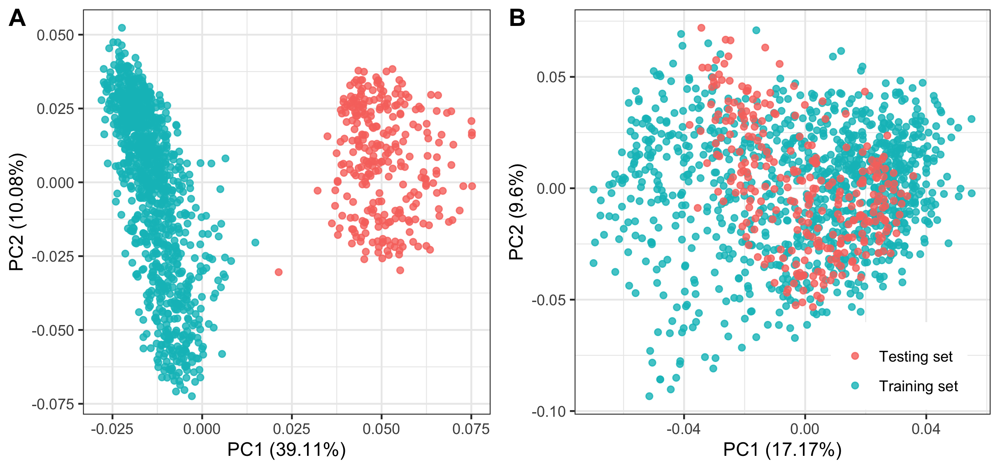
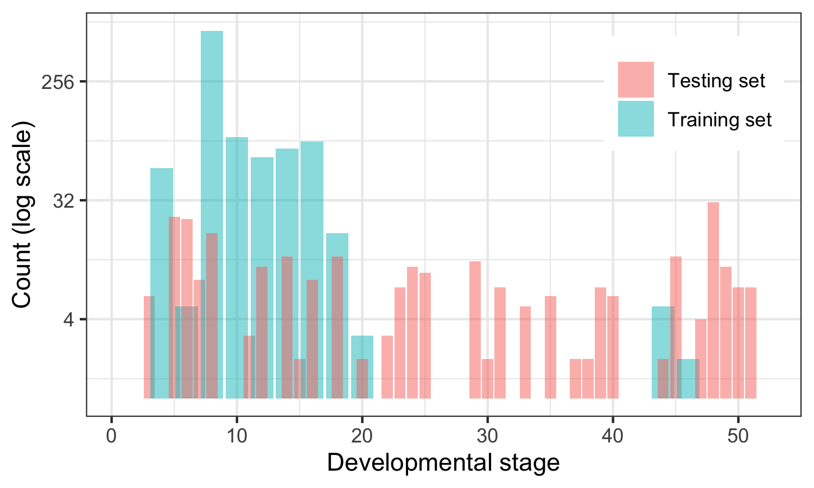

## Results
### Batch effect adjustment
Before batch adjustment, the two datasets are clearly separated in the first two principal component dimensions (Fig. {@fig:PACbatch}A).
After being adjusted for batch effect, this dataset-specific effect is less evident (Fig. {@fig:PACbatch}B).
The amount of variance explained in each component also seems to be more balanced.
{#fig:PACbatch width="100%"}

The training dataset consists of 1043 in vivo parasite isolates, each with 4952 transcriptomic features, out of which STIR selects 1068.

TPOT cross-validated balanced accuracy...

### Test sample selection
In general, the parasite developmental stages in the training set are smaller than those in the test set (Fig. {@fig:stages}).
{#fig:stages width="100%"}

