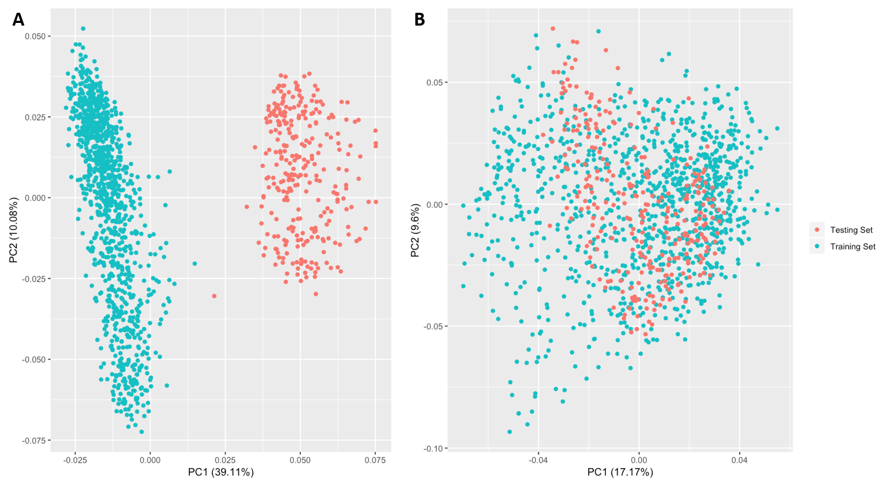

---
author-meta:
- Alena Orlenko
- Trang T. Le
- Weixuan Fu
- Jason H. Moore
date-meta: '2019-08-13'
keywords:
- markdown
- publishing
- manubot
lang: en-US
title: 'The Malaria DREAM challenge: team TPOT''s sub-challenge 2 write-up'
...

<small><em>
This manuscript
([permalink](https://trang1618.github.io/plasmodium-falciparum/v/98e0f2c98e4b0e89ddcec3d124e668d18870f37d/))
was automatically generated
from [trang1618/plasmodium-falciparum@98e0f2c](https://github.com/trang1618/plasmodium-falciparum/tree/98e0f2c98e4b0e89ddcec3d124e668d18870f37d)
on August 13, 2019.
</em></small>

## Authors

+ **Alena Orlenko** 
    {.inline_icon}
    [0000-0003-1757-293X](https://orcid.org/0000-0003-1757-293X)
    · {.inline_icon}
    [desmidium](https://github.com/desmidium)
    · {.inline_icon}
    [desmidium](https://twitter.com/desmidium) 
  <small>
     Department of Biostatistics, Epidemiology and Informatics, Institute for Biomedical Informatics, University of Pennsylvania, Philadelphia, PA 19104
  </small>

+ **Trang T. Le** 
    {.inline_icon}
    [0000-0003-3737-6565](https://orcid.org/0000-0003-3737-6565)
    · {.inline_icon}
    [trang1618](https://github.com/trang1618)
    · {.inline_icon}
    [trang1618](https://twitter.com/trang1618) 
  <small>
     Department of Biostatistics, Epidemiology and Informatics, Institute for Biomedical Informatics, University of Pennsylvania, Philadelphia, PA 19104
  </small>

+ **Weixuan Fu** 
    {.inline_icon}
    [0000-0002-6434-5468](https://orcid.org/0000-0002-6434-5468)
    · {.inline_icon}
    [weixuanfu](https://github.com/weixuanfu)
    · {.inline_icon}
    [weixuanfu](https://twitter.com/weixuanfu) 
  <small>
     Department of Biostatistics, Epidemiology and Informatics, Institute for Biomedical Informatics, University of Pennsylvania, Philadelphia, PA 19104
  </small>

+ **Jason H. Moore** 
    {.inline_icon}
    [0000-0002-5015-1099](https://orcid.org/0000-0002-5015-1099)
    · {.inline_icon}
    [EpistasisLab](https://github.com/EpistasisLab)
    · {.inline_icon}
    [moorejh](https://twitter.com/moorejh) 
  <small>
     Department of Biostatistics, Epidemiology and Informatics, Institute for Biomedical Informatics, University of Pennsylvania, Philadelphia, PA 19104
     · Funded by National Institutes of Health Grant Nos. LM010098, LM012601, AI116794
  </small>

## Abstract {.page_break_before}

In the subchallenge 2, the training set were collected very differently in comparison with the test set.
Especially, training set is *in vivo* transcription data set described in [@6Qb18jcS] while test set is *in vitro* transcription data set.
To adjust know batch effects, ComBat algorithm[@1HahRBkyb] in sva package[doi:10.1093/bioinformatics/bts034] was applied on the high-throughput transcription data and principal component analysis plots on the raw data and adjusted data were made for checking the performance of adjustment (Fig. {@fig:PACbatch}). 

{#fig:PACbatch width="100%"}

## References {.page_break_before}

<!-- Explicitly insert bibliography here -->

